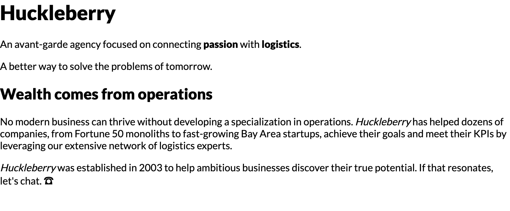

# Huckleberry Agency Website

In this workshop, you'll build a minimal landing page for an agency.

This mockup is built entirely using _flow layout_: no Flexbox, no grid, no absolute positioning, no media queries. It relies heavily on padding, margin, and border, as well as some of the tricks we learned in Module 1.


The design is available on Figma:

- https://www.figma.com/file/6hGqKA5scrZJScb9KW3Hj2/Huckleberry

## Setup Instructions

This project uses an NPM package called "live-server" — it provides a basic local file server, so that you can view the HTML file in-browser, and automatically reloads the page when the HTML/CSS changes.

Start by installing dependencies:

```
npm install
```

Run the "start" script to start the server:

```
npm run start
```

You should see a confirmation message like this:


You can visit `http://localhost:9000` to view the page. You should see a bunch of unstyled content:



> **Trouble with this process?**
>
> Because this project is vanilla HTML and CSS, you can always open the HTML file in your browser, without fussing with a local file server.
>
> Certain JS APIs won't work when viewing files in this way, but that isn't a concern for this project.
